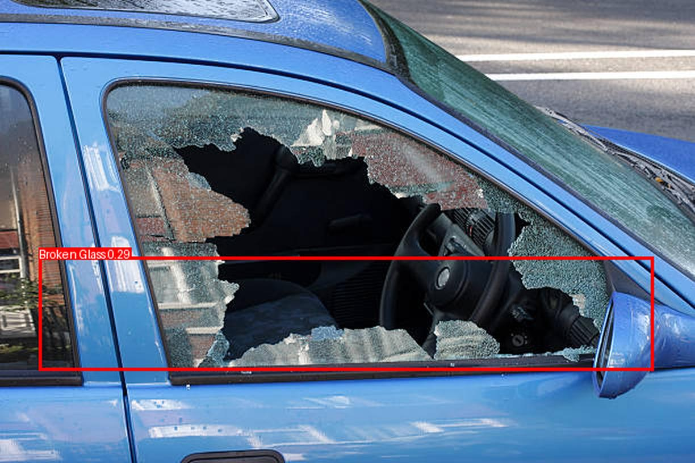

# 🚗 Car Damage Detection using YOLOv5  

This project is a **Flask-based web application** that allows users to upload images of cars and detect damage using **YOLOv5 (You Only Look Once)**. The model processes the image, annotates the damaged areas, and displays the result directly on the web page.  

---

## 📌 Features  
✅ Upload car images for real-time damage detection  
✅ YOLOv5-based object detection for identifying damaged areas  
✅ Glowing, modern UI with **Bootstrap & jQuery**  
✅ Flask backend for image processing  
✅ Displays annotated image on the same page (No redirects)  

---

## 📸 Demo  
  

---

